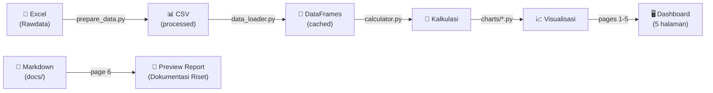
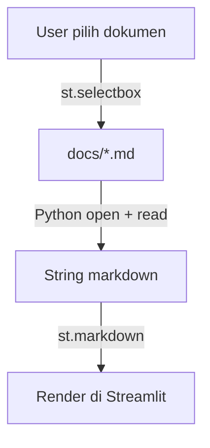

# 🏗️ Konsep Monorepo — CELIOS EBT Dashboard

## Struktur Folder

```
8.1 Celios4-EBTsmallstack/
│
├── 📁 refrensi/                          # EXISTING — referensi & data mentah
│   └── 📁 Data/
│       ├── 📁 Rawdata/
│       │   └── Energi Terbarukan(AutoRecovered).xlsx
│       ├── 📁 extracted/                 # hasil extract PDF → txt
│       └── *.pdf                         # PDF asli dari PODES
│
├── 📁 docs/                              # DOKUMENTASI RISET — report & analisis
│   ├── report_insight_data_EBT_PODES.md  # laporan insight data lengkap
│   ├── strategi_narasi_EBT.md            # strategi 3 narasi & arah analisis
│   ├── metodologi_teknis_report.md       # dokumentasi metodologi step 1-6
│   └── konsep_monorepo_EBT.md            # dokumen ini
│
├── 📁 data/                              # DATA LAYER — data bersih siap pakai
│   ├── 📁 processed/                     # CSV hasil olahan dari Excel
│   │   ├── nasional_summary.csv
│   │   ├── provinsi_akses_energi.csv
│   │   ├── provinsi_energi_surya.csv
│   │   ├── provinsi_energi_air.csv
│   │   ├── provinsi_bioenergi.csv
│   │   ├── provinsi_infrastruktur.csv
│   │   ├── provinsi_kebijakan.csv
│   │   ├── provinsi_aset_alam.csv
│   │   ├── provinsi_kerusakan.csv
│   │   ├── provinsi_desa_tambang.csv
│   │   └── crosstab_tambang_ebt.csv
│   └── prepare_data.py                   # script konversi Excel → CSV
│
├── 📁 src/                               # SOURCE — logic & komponen
│   ├── 📁 utils/
│   │   ├── data_loader.py
│   │   ├── calculator.py
│   │   └── formatter.py
│   ├── 📁 charts/
│   │   ├── bar_charts.py
│   │   ├── heatmaps.py
│   │   ├── scatter_plots.py
│   │   ├── trend_lines.py
│   │   └── kpi_cards.py
│   └── 📁 components/
│       ├── sidebar.py
│       ├── header.py
│       └── download.py
│
├── 📁 pages/                             # STREAMLIT PAGES (6 halaman)
│   ├── 1_Overview_Nasional.py
│   ├── 2_Desa_Tambang.py
│   ├── 3_Gap_Potensi_EBT.py
│   ├── 4_Ketimpangan_Energi.py
│   ├── 5_Eksplorasi_Data.py
│   └── 6_Dokumentasi_Riset.py            # ← NEW: preview report & docs
│
├── Dashboard.py                          # ENTRY POINT Streamlit
├── requirements.txt
├── .streamlit/
│   └── config.toml
└── README.md
```

---

## Fungsi Setiap Layer

### 1. `refrensi/` — Sumber Data Mentah
> **Tidak diubah.** Arsip data asli.

| File | Fungsi |
|---|---|
| `Rawdata/*.xlsx` | Data mentah PODES |
| `Data/*.pdf` | PDF asli 13 sheet |
| `Data/extracted/*.txt` | Hasil extract PDF → teks |

### 2. `docs/` — Dokumentasi Riset ← **NEW**
> **Semua dokumen riset disimpan di sini.** Bisa di-preview langsung dari Streamlit halaman 6.

| File | Isi |
|---|---|
| `report_insight_data_EBT_PODES.md` | Laporan lengkap 10 dimensi + temuan kritis + rencana analisis lanjutan |
| `strategi_narasi_EBT.md` | 3 narasi besar + struktur output Streamlit |
| `metodologi_teknis_report.md` | Step 1–6 + algoritma & formula |
| `konsep_monorepo_EBT.md` | Dokumen ini — arsitektur project |

### 3. `data/` — Data Layer
> Jembatan data mentah → visualisasi.

| File | Fungsi |
|---|---|
| `prepare_data.py` | Baca Excel → bersihkan → simpan CSV |
| `processed/*.csv` | CSV bersih per dimensi |

### 4. `src/utils/` — Logic Layer
> Kalkulasi indeks, scoring, formatting.

| File | Fungsi |
|---|---|
| `data_loader.py` | Load CSV + `@st.cache_data` |
| `calculator.py` | Gap ratio, indeks komposit, ranking |
| `formatter.py` | Format angka, warna, label |

### 5. `src/charts/` — Visualization Layer
> Pustaka chart reusable.

| File | Output |
|---|---|
| `kpi_cards.py` | Kartu angka kunci |
| `bar_charts.py` | Bar & grouped bar |
| `heatmaps.py` | Heatmap provinsi |
| `scatter_plots.py` | Scatter & bubble |
| `trend_lines.py` | Tren 2021 → 2024 |

### 6. `src/components/` — UI Components
> Komponen UI berulang.

| File | Fungsi |
|---|---|
| `sidebar.py` | Filter provinsi, tahun, dimensi |
| `header.py` | Logo CELIOS, judul |
| `download.py` | Tombol download CSV/gambar |

### 7. `pages/` — Streamlit Pages (6 halaman)
> Halaman 1–5 = dashboard analisis, Halaman 6 = preview dokumentasi.

| Halaman | Konten |
|---|---|
| Overview Nasional | KPI cards, tren, ringkasan |
| Desa Tambang | Crosstab tambang × EBT |
| Gap Potensi EBT | Gap analysis, tren menurun |
| Ketimpangan Energi | Peta ketimpangan, scatter |
| Eksplorasi Data | Filter bebas, tabel, download |
| **Dokumentasi Riset** | **Preview report .md dari `docs/`** |

---

## Alur Data



---

## Alur Preview Report (Halaman 6)



**Cara kerja halaman Dokumentasi Riset:**
1. User pilih dokumen dari dropdown (`st.selectbox`)
2. Streamlit baca file `.md` dari folder `docs/`
3. Render sebagai markdown di halaman (`st.markdown`)
4. User bisa baca report langsung di browser tanpa buka file

---

## Dependencies (`requirements.txt`)

```
streamlit
pandas
plotly
openpyxl
scipy
scikit-learn
```
