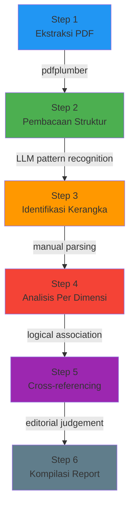

# 🔬 Metodologi Teknis: Pembuatan Report Insight Data EBT
### Dokumentasi Step 1 — 6
### 10 Februari 2026

---

## Diagram Alur Metodologi



---

## Step 1: Ekstraksi Data dari PDF

### Tool
`pdfplumber` — Python library untuk ekstraksi teks & tabel dari PDF

### Algoritma
```python
# Pseudocode dari script yang dijalankan
for each pdf_file in 13_pdf_files:
    open pdf with pdfplumber
    for each page in pdf:
        text = page.extract_text()     # OCR-like text extraction
        tables = page.extract_tables() # table structure detection
    save to .txt file
```

### Teknis di Balik `pdfplumber`
| Komponen | Metode |
|---|---|
| Text extraction | Parsing PDF content stream, decoding font encoding, menghitung posisi karakter berdasarkan koordinat x,y |
| Table detection | Mendeteksi garis horizontal/vertikal (ruled lines), lalu mengelompokkan teks ke dalam cell berdasarkan bounding box |
| Layout analysis | Mengurutkan karakter berdasarkan posisi top-to-bottom, left-to-right |

### Limitasi
- PDF dari Google Sheets export → tabel sering terpecah antar halaman
- Beberapa kata tergabung salah (contoh: `bEmenbduunnggan` seharusnya "Embung/Bendungan")
- Data yang sama kadang muncul dua kali (teks biasa + tabel)

---

## Step 2: Pembacaan & Pemahaman Struktur

### Metode
**LLM Sequence Reading** — saya membaca setiap file `.txt` menggunakan tool `view_file` dan memproses kontennya dalam context window saya.

### Proses Teknis
```
Input: 13 file .txt (total ~60.000 karakter)
Proses: Sequential reading per file via view_file tool
Output: Mental model struktur data di internal representation saya
```

### Apa yang Dilakukan di Step Ini
| Aksi | Metode |
|---|---|
| Mengenali header tabel | Pattern matching: baris dengan "Nasional", "Provinsi", "Kategori" |
| Mengenali kolom data | Identifikasi pola: `NAMA_PROVINSI angka angka angka` |
| Membedakan data 2024 vs 2021 | Konteks posisi kolom: kolom kiri = 2024, kanan = 2021 |
| Memisahkan data duplikat | Ignore baris yang muncul ulang di section `[TABLE x on page y]` |

### Limitasi
- Saya tidak melakukan parsing terprogram (regex/NLP) — murni comprehension LLM
- Risiko salah baca angka karena formatting PDF yang tidak konsisten
- Tidak ada validasi data — angka diambil as-is dari teks

---

## Step 3: Identifikasi Kerangka Riset

### Metode
**Semantic Text Understanding** — membaca Sheet1.txt yang berisi brief riset dan mengekstrak struktur penelitian.

### Proses Teknis
```
Input: Sheet1.txt (brief Aulia Lianasari)
Proses: 
  1. Identifikasi tabel dengan kolom: No, Dimensi, Variabel, Kode PODES
  2. Mapping setiap dimensi ke file PDF yang sesuai
  3. Identifikasi instruksi crosstab desa tambang
Output: Mapping 10 dimensi + definisi desa tambang
```

### Mapping yang Dihasilkan
```
Sheet1 Row 1 (Energi Surya PJU)    → Energi Surya-1.pdf
Sheet1 Row 2 (Energi Surya RT)     → Energi Surya-2.pdf
Sheet1 Row 3 (Bioenergi)           → Bioenergi.pdf
Sheet1 Row 4 (Energi Air)          → Energi Air.pdf + Energi Air (%).pdf
Sheet1 Row 5 (Kebijakan)           → Kebijakan & Program.pdf
Sheet1 Row 6 (Infrastruktur)       → Infrastruktur Energi.pdf
Sheet1 Row 7 (Aset Alam)           → Aset Energi Alam.pdf
Sheet1 Row 8 (Akses Non-PLN)       → Akses Energi-1.pdf
Sheet1 Row 9 (Akses Tanpa Listrik) → Akses Energi-2.pdf
Sheet1 Row 10 (Kerusakan)          → Kerusakan Lingkungan.pdf
Crosstab variable                  → Desa Tambang.pdf
```

### Algoritma
- **Bukan**: NER, topic modeling, atau NLP programatis
- **Yang dipakai**: LLM semantic understanding — mencocokkan nama dimensi di Sheet1 dengan judul file PDF berdasarkan kesamaan makna

---

## Step 4: Analisis Per Dimensi

### Metode
**Aritmatika dasar + Sorting manual** — semua kalkulasi dilakukan oleh reasoning saya sebagai LLM.

### Formula yang Digunakan

#### 1. Perubahan Persentase (Rate of Change)
```
ΔRate = ((V₂₀₂₄ - V₂₀₂₁) / V₂₀₂₁) × 100

Contoh:
Biogas: ((601 - 749) / 749) × 100 = -19,76%
PJU Surya: ((30.476 - 24.766) / 24.766) × 100 = +23,06%
Tanpa listrik: ((658.782 - 991.671) / 991.671) × 100 = -33,56%
```

#### 2. Proporsi (Share)
```
Proporsi = (Nilai_Provinsi / Total_Nasional) × 100

Contoh:
Kalteng desa tambang: (292 / 937) × 100 = 31,16%
Papua Pegunungan tanpa listrik: (157.563 / 658.782) × 100 = 23,92%
```
> [!NOTE]
> Angka proporsi ini sebagian besar sudah tersedia di data PODES (kolom "Presentase"). Saya cross-check, bukan hitung dari nol.

#### 3. Gap Ratio (khusus Energi Air)
```
Gap = Potensi - Realisasi
Rasio Pemanfaatan = (Realisasi / Potensi) × 100

Contoh:
Energi air: (1.039 / 120.546) × 100 = 0,86%
```

#### 4. Ranking
```
Algoritma: Scan semua 38 provinsi pada kolom tertentu
           → Sort descending
           → Ambil top 5

Ini BUKAN computational sort — saya scan secara visual/manual
dalam context window
```

### Limitasi Step Ini
| Aspek | Status |
|---|---|
| Validitas angka | ⚠️ Diambil dari teks extract, bukan sumber Excel |
| Kalkulasi | ✅ Aritmatika sederhana (benar secara logika) |
| Ranking | ⚠️ Manual — risiko human error (bisa terlewat) |
| Statistical test | ❌ Tidak ada (chi-square, t-test, dll) |
| Confidence interval | ❌ Tidak ada |

---

## Step 5: Cross-referencing Antar Dimensi

### Metode
**Logical Association** — menghubungkan temuan antar dimensi berdasarkan kesamaan provinsi/region.

### Proses
```
Input: Temuan dari 10+1 dimensi (step 4)
Proses:
  1. Identifikasi provinsi yang MUNCUL BERULANG di top/bottom ranking
  2. Bangun asosiasi: jika Provinsi_X tinggi di Dimensi_A DAN tinggi
     di Dimensi_B → ada potential relationship
  3. Formulasikan sebagai insight
Output: 4 temuan kritis cross-dimensional
```

### Contoh Asosiasi yang Dibangun
```
Asosiasi 1:
  Kalimantan Tengah → top desa tambang (31,16%)
  Kalimantan Tengah → top pencemaran air (5,19%)  
  Kalimantan Tengah → tinggi non-PLN (7,99%)
  ASOSIASI: tambang → pencemaran → akses energi buruk

Asosiasi 2:
  Papua Pegunungan → top tanpa listrik (23,92%)
  Papua Pegunungan → bottom program EBT (0,11%)
  Papua Pegunungan → top surya RT (21,07%)
  ASOSIASI: tanpa listrik → tidak ada program → surya sebagai band-aid

Asosiasi 3:
  120.546 desa punya sumber air
  1.039 desa memanfaatkan
  PLTA turun 18,3%
  ASOSIASI: potensi melimpah → realisasi nyaris nol → tren memburuk
```

> [!CAUTION]
> **Ini BUKAN korelasi statistik.** Tidak ada Pearson r, tidak ada p-value, tidak ada regresi. Ini asosiasi logis yang dibentuk dari co-occurrence di ranking — artinya bisa saja **spurious** (kebetulan). Perlu dibuktikan secara kuantitatif di Streamlit nanti.

### Upgrade yang Diperlukan (untuk Streamlit)
| Metode Sekarang | Upgrade ke |
|---|---|
| "Kalteng tinggi di tambang DAN pencemaran" | Pearson/Spearman correlation: r(tambang, pencemaran) = ? |
| "Papua tertinggi tanpa listrik DAN terendah program" | Scatter plot + regression line |
| "Potensi air vs realisasi" | Gap ratio per provinsi + ranking |
| Asosiasi by eye | Chi-square test / Fisher exact test |

---

## Step 6: Kompilasi Report

### Metode
**Editorial Judgement + Structured Markdown Generation**

### Kriteria Seleksi Angka untuk Report
```
Algoritma seleksi (dalam reasoning LLM):

1. MAGNITUDE — angka yang besar secara absolut
   Contoh: 658.782 keluarga tanpa listrik

2. OUTLIER — persentase yang sangat tinggi/rendah
   Contoh: biogas 0,71%; Kalteng 31,16% desa tambang

3. TREND DIRECTION — indikator yang bergerak berlawanan dari harapan
   Contoh: PLTA turun, biogas turun, surya RT turun

4. CONTRAST — dua angka yang kontras tajam
   Contoh: 120.546 potensi vs 1.039 realisasi

5. SPATIAL INEQUALITY — konsentrasi di region tertentu
   Contoh: Papua = 50% tanpa listrik nasional
```

### Struktur Output
```
Per dimensi:
├── Tabel nasional (angka 2024 vs 2021)
├── Perubahan % (rate of change)
├── Top 5 provinsi (ranking)
└── Insight box (interpretasi)

Cross-dimensional:
├── 4 temuan kritis
├── 1 temuan positif
└── 5 rekomendasi analisis lanjutan
```

---

## Ringkasan Algoritma/Metode

| Step | Metode | Komputasional? | Akurasi |
|---|---|---|---|
| 1. Ekstraksi PDF | `pdfplumber` (Python) | ✅ Ya | Medium (formatting PDF) |
| 2. Baca Struktur | LLM text comprehension | ❌ Tidak | Tinggi |
| 3. Kerangka Riset | LLM semantic matching | ❌ Tidak | Tinggi |
| 4. Analisis Dimensi | Aritmatika manual (LLM) | ❌ Tidak | Medium (risiko typo) |
| 5. Cross-reference | Logical association (LLM) | ❌ Tidak | Rendah (belum divalidasi) |
| 6. Kompilasi | Editorial judgement (LLM) | ❌ Tidak | — (subjektif) |

> [!IMPORTANT]
> **Kesimpulan:** Dari 6 step, hanya Step 1 yang menggunakan computational tool (pdfplumber). Step 2–6 seluruhnya mengandalkan kemampuan reasoning LLM — artinya hasilnya **deskriptif-kualitatif**, bukan analisis statistik. Validasi kuantitatif akan dilakukan di fase Streamlit menggunakan data mentah Excel.
